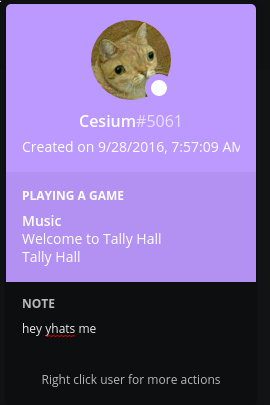

# song status thingy

i hope this isnt against discord tos lol

just paste an application id in and do `python3 run.py` and cross your fingers

## requirements

uhh linux, playerctl, discord and python

## problems

boy is this list gonna get long

 * doesnt show cover art
 * bad
 * the song sticks around when you pause
 * no way of picking the player if there are multiple
 * probably crashes if the needed metadata is missing, idk i dont test stuff
 * says playing a game instead of listening to
    * cant remember if thats something i can actually change in rpc or not lol
 * probably many more somehow

## credits or something

the whole part of this that actually does stuff (./rpc.py) is yoinked from [niveshbirangal/discord-rpc](https://github.com/niveshbirangal/discord-rpc)